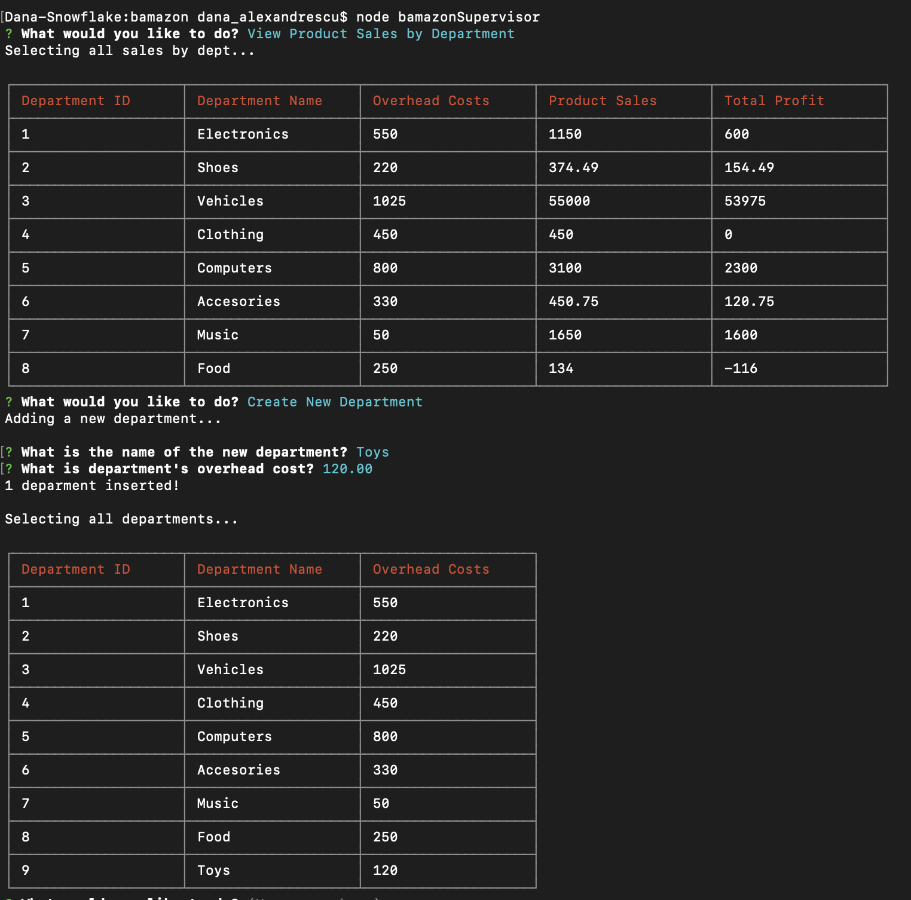

# bamazon

This cli node app is a Amazon-like storefront that will take in orders from customers and deplete stock from the store's inventory.
It also tracks product sales across departments and then provides a summary of the highest-grossing departments in the store.

### Overview
The application has 3 different views - Customer, Manager, Supervisor that connect to a database and depending on which screen it's run it gives certain access to the user to select, update, or insert products and departments into the database.

### Technologies

This app is written in JavaScript with Node and the help of mysql, inquirer, and cli-table modules. 
All modules listed in the `package.json` file.
Uses MySql with the database `bamazon` and two tables `Departments` `Products`

### Instructions

1. Install node.js in order to be able to run the CLI app
2. After you cloned the repository run `npm install` to add all the modules listed in the `package.json` file
3. To run the Customer View use `node bamazonCustomer`. 
    a.  Select to either continue buying a product or exit the app.  
    b.  To buy a product enter the product ID from the list and the quantity.  
    c.  The app will output the total price of the purchase and substract the amount out of the inventory.
4. To run the Manager View use `node bamazonManager`.  
    a.  Choose from `View Products for Sale`, `View Low Inventory`, `Add to Inventory`, `Add new product`, `exit`
    b.  The Options will allow the user to view or manipulate inventory. 
    c.  The app will output the transactions or all products in a nice table built with cli-table module
5. To run the Supervisor View use `node bamazonSupervisor`.
    a.  The `View Product Sales by Department` option uses the `Department` table to create a join between products and departments and provides a summary of total sale and profits across departments.
    b.  The `Create New Department` option inserts a new department with it's overhead costs.
6.  All prompt menus have an option to exit the app.

### Screenshots

* Customer View

* Manager Views

* Supervisor Views

### GitHub Link

https://github.com/danalittleskier/bamazon

### Role

Dana Alexandrescu - developer
